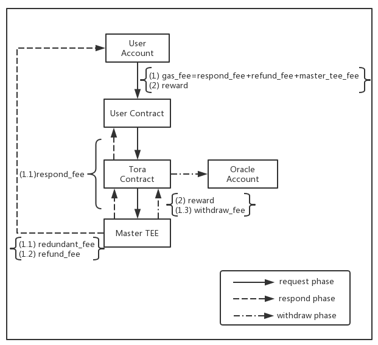

# Tora-Zilliqa

Tora-Zilliqa is a TEE-based, Trusted Oracle implement for [Zilliqa Blockchain](https://zilliqa.com/). 

## Overview

Existing blockchain is a monolithic and isolated system, which can neither listen to the outside world or show abundant semantics itself (e.g., random number generation, access to private data). In addition, the global redundant computation makes the on-chain operations too expensive, which significantly limits the expressiveness of traditional blockchain.

Tora is a trusted off-chain extended service for blockchain system, used for (i)efficiently fetching data from outside authenticated sources and (ii) delegating heavy workload to off-chain execution environment. Tora is built based on Trusted Execution Environment (e.g., Intel SGX, ARM TrustZone), shifting a part of trust to the verifiable code in a hardware-protected enclave, which can defend against attacks from malicious software (including privileged software like OS and hypervisor) and hardware. Tora builds a bridge between blockchain and the outside world (similar to Oracle but more flexible).  

## Features

* Fetch outside data ✅ :
  * Support access to authenticated data sources and call Web API based on HTTP protocol.
  * Support major HTTP methods, e.g., GET，POST.
  * Provide authentication through HTTPs protocol.

* Connect to other decentralized networks: 
  * Support decentralized storage including IPFS、SWARM.
  * Support access data from other blockchain，e.g., check an account, call a smart contract, verify a transaction, etc.
  * Apply to major decentralized consensus，and verify the integrity of data.
* Trusted computation:
  * Allow users to call off-chain procedures. That is, Tora will collect users input, execute the user-defined program and return the result up to the blockchain.
  * Support major programming languages such as Python, and can run unmodified programs directly.
  * Provide proof of integrity. 
  * Support private computation and secure channel based on TEE
* Others
  * Trusted random number generation
  * Key management and encrypted Storage
  * More


## Architecture

   


* **Tora SC** is a public official smart contract which process the request from user contracts. Similar to existing oracle system. Tora adopts the request-response pattern. On the one hand, users can construct arguments to specify request type, content and callback address through the API provided by Tora SC. Users are required to pay a certain amount of money to cover the off-chain computational cost and the gas for putting results onto the blockchain. On the other hand, Tora SC serves as a relay between user contracts and the outside world in that it allows Tora backend to pull request information and accepts valid responses from the backend.

* **Tora Worker** is a trusted system made up of several components which are running inside TEEs. The **monitor** checks the Tora SC regularly to collect pending requests and verify the validity of these requests. The **Processors** are responsible for main operations. There are three types processors: **executors**, **relays** and **collectors**. Collectors fetch data from web API, relays can access and verify data from other decentralized systems, and executors can execute user-defined programs with integrity proof.

* **Master TEE** serves as a trusted KMS and scheduler. A Worker is required to ask an online master for a signature before she submit a response back to the blockchain. A Master TEE will identify the worker through remote attestation before it generates a valid signature. It also guarantees that no repeating or conflicting responses. Ideally, there will be several masters to compose a distributed network for availability.


## Token Flow



* **Gas fee** covers the money for overall gas, including respond phase, respond phase and withdraw phase.

* **Reward** is the money for the oracle node that responds the request.
* In the **request** phase, the user will transter overall gas fee and reward to the master tee.
* In the **responding** phase, the redundant gas fee will be refunded to the user account after responding successfully. However, if the respond gas fee provided by user isn't enough to respond, the consumed gas will not be returned.
* In the **withdraw** phase, the reward will be transfered to the oracle account. Master TEE covers the gas fee with the user provided fee.

---

# Installation

## Prerequisites

* Hardware Requirement:
  * 6th Generation Intel(R) Core(TM) Processor or newer
  * Configure the system with the SGX hardware enabled option
* Operating System Requirement:
  * Ubuntu 16.04
* Software Requirement:
  * [Intel SGX Driver v1.9](https://github.com/intel/linux-sgx-driver/tree/sgx_driver_1.9)
  * [Intel SGX SDK v2.1](https://github.com/intel/linux-sgx/tree/sgx_2.1)
  * [Docker](https://www.docker.com/)


## Installation

The following steps describe the installation for Tora **worker** and **master**. 

**Note:** You can install them on two devices or just on the same decice for test. But before the installation, make sure you have installed intel-sgx driver and  **/dev/isgx** should appear **on each device**.


###  Environment Initialization

Pull the Tora-Zilliqa source code, then switch to to the **env** folder, enter the following command:

```
  $ cd /Path/To/Tora-Zilliqa/env
  $ ./init_env.sh  
```
### Pull Docker Image

1. Pull the the two docker images on each device separately, and start a container for each image with sgx device support. 

  * 1.1 for the worker:

```
  $ docker pull teexio/tora_zilliqa_worker
  $ docker run --device /dev/isgx -it teexio/tora_zilliqa_worker /bin/bash
```

  * 1.2 for the master TEE node:

```
  $ docker pull teexio/tora_zilliqa_master
  $ docker run --device /dev/isgx -p 1234:1234 -it teexio/tora_zilliqa_master /bin/bash
```

2. Before launching the applicatoin, you need to do some initialization inside each container. 

```
  $ cd /root
  $ source init.sh
```

3. check if the sample code works in each container.

```
  $ cd /root/SampleCode/LocalAttestation
  $ make 
  $ ./app
```
---

# Tutorial

## For master TEE

* `cd /home/Python-KMS`
* Run the master TEE
  * `~/Zilliqa/build/matroska /usr/local/bin/python3 -B server.py main --host 0.0.0.0 --port 1234`
  * Explanation
    * -B option is for loading the files without pyc files. If pyc files already generated, can delete the pyc files by`find . -name "*.pyc" -exec rm -f {} \;`
    * When the new machine run the master TEE for the first time, master_tee_address will be generated and print on the console

* Tora contract deployment
  * Modify contracts/Tora.scilla，set the according master_tee_address
  `let master_tee_address = 0x...`
  * Deploy the Tora contract, the example code is in tests/deploy_contract_test.py
  * Publish the Tora contract address

## For Oracle Node

* `cd /home/Tora-Zilliqa`

* config.ini

  ```
  [auth]
     master-host = ""
     account = "zil10h9339zp277h8gmdhds6zuq0elgpsf5qga4qvh"

  [BaseChain]
     [[zilliqa]]
        rpc-server = "https://dev-api.zilliqa.com/"
        network-id = "333"
        version = "21823489"
        contract-address = "zil165m736j7ht0x6chwsg096rdnrfhu9r8a7r7e4r"

  [KMS]
     host = 192.168.1.19
     port = 1234

  [debug]
     level = DEBUG
     log-file = stdout
  ```

  Parameter Explanation

  * account = oracle node account address
  * contract-address = Tora contract address
  * host, port = The host and port of the kms server
  * level, log-file = Log option

* Launch the oracle node

  ```
    $ ~/Zilliqa/build/matroska /usr/local/bin/python3 -B tora.py launch —-config config.ini
  ```

* Withdraw reward

  ```
    $ ~/Zilliqa/build/matroska /usr/local/bin/python3 -B tora.py withdraw —-config config.ini --sk 0x00000000001 —-address zil00000000001
  ```

  It needs about a few minutes to process the withdraw on chain

## For User

### Prerequisites

* A normal Operating System **without SGX device**
* Python3.6
* Clone Tora-Zilliqa source code from <https://github.com/TEEXIO/Tora-Zilliqa>
* Some python dependencies for pyzil lib
  
  ```
   $ cd {YOURPATH}/Tora-Zilliqa/backend/lib/pyzil
   $ pip install -r requirements.txt
  ```
   * If there are some errors in MacOS, please check if you have installed **gmp**.You can install **gmp** as follows:
    ```
     $ brew install gmp
     $ export LDFLAGS="-L/usr/local/opt/openssl/lib -L /usr/local/opt/gmp/lib" && export CPPFLAGS="-I/usr/local/opt/openssl/include -I/usr/local/opt/gmp/include"
    ```

### A simple case

* Write the user contract，the example contract is in **contracts/Request.scilla** and **contracts/GeneralRequest.scilla**

  *  Request.scilla is for the trial to fetch data on the top 100 trading pairs from the top 10 exchanges. GeneralRequest.scilla is for the general request to  fetch data from a general web api.

  * Parameter Explanation

    * Tora contract address ```let oracle_address = 0x...```

      Tip: You can transfer the oracle address in zil… format to hex format with this function

      ```
      oracle_address = '0x' + zilkey.to_valid_address("zil...")
      ```

    * set the gas price and gas limit of the response

      ```
      let gas_price_set = Uint128 1000000000
      let gas_limit_set = Uint128 10000
      ```

* Deploy the user contract with your account sk and find the contract address on Zilliqa Explorer, the example code is in tests/deploy_contract_test.py

* Invoke the user contract, the example code is in tests/request_test.py

  ```
  # user account
  account = Account(private_key="Your account sk")
  # request contract address
  contract_addr = "User contract address(Zil...)"
  contract = Contract.load_from_address(contract_addr)
  contract.account = account
  # invoke the contract
  resp = contract.call(method="request", params=[], amount=15)
  ```

  The amount include four parts of fee：

  * The reward for oracle node(>=1ZIL)
  * The gas fee for response(gas_price_set*gas_limit_set)
  * The gas fee for refunding remain response gas fee(0.001ZIL)
  * The gas fee for oracle node withdraw(about 1ZIL)

  If amount< the least fee, an event 'No enough money' will return
