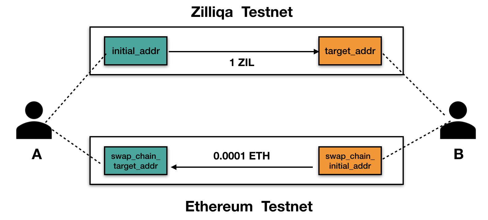
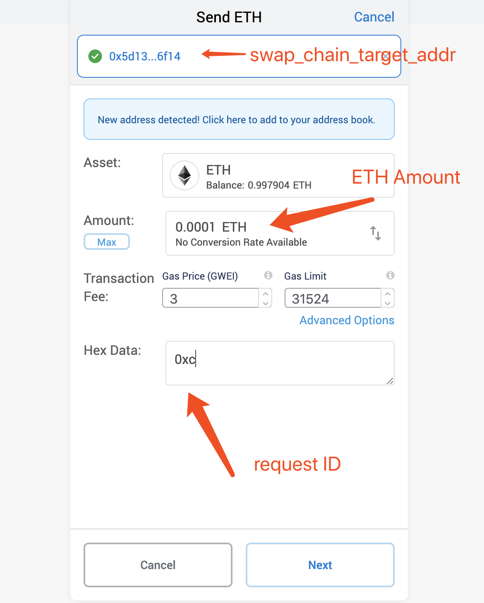

# Tora-Zilliqa

Tora-Zilliqa is a TEE-based, Trusted Oracle implement for [Zilliqa Blockchain](https://zilliqa.com/). 

# Overview

Existing blockchain is a monolithic and isolated system, which can neither listen to the outside world or show abundant semantics itself (e.g., random number generation, access to private data). In addition, the global redundant computation makes the on-chain operations too expensive, which significantly limits the expressiveness of traditional blockchain.

Tora is a trusted off-chain extended service for blockchain system, used for (i)efficiently fetching data from outside authenticated sources and (ii) delegating heavy workload to off-chain execution environment. Tora is built based on Trusted Execution Environment (e.g., Intel SGX, ARM TrustZone), shifting a part of trust to the verifiable code in a hardware-protected enclave, which can defend against attacks from malicious software (including privileged software like OS and hypervisor) and hardware. Tora builds a bridge between blockchain and the outside world (similar to Oracle but more flexible).  

### Features

- [x] Fetch outside data :
  * Support access to authenticated data sources and call Web API based on HTTP protocol.
  * Support major HTTP methods, e.g., GET，POST.
  * Provide authentication through HTTPs protocol.

- [x] Connect to other decentralized networks: 
  * Support decentralized storage including IPFS、SWARM.
  * Support access data from other blockchain，e.g., check an account, call a smart contract, verify a transaction, etc.
  * Apply to major decentralized consensus，and verify the integrity of data.
- [ ]  Trusted computation:
  * Allow users to call off-chain procedures. That is, Tora will collect users input, execute the user-defined program and return the result up to the blockchain.
  * Support major programming languages such as Python, and can run unmodified programs directly.
  * Provide proof of integrity. 
  * Support private computation and secure channel based on TEE
- [ ] Others
  * Trusted random number generation
  * Key management and encrypted Storage
  * More


### v0.1.2 
Supports trusted relay for fetching information from other decentralized systems. This version provides a dedicated relay connected to Ethereum network, which can query transactions and data of accounts or smart contracts from Ethereum,  and verify the Merkle-proof along with cumulative proof of work for integrity guarantees. It also provides several testcases including [an atomic cross-chain swap](#2-atomic-cross-chain-swap) between Zilliqa and Ethereum.


# Architecture

   


* **Tora SC** is a public official smart contract which process the request from user contracts. Similar to existing oracle system. Tora adopts the request-response pattern. On the one hand, users can construct arguments to specify request type, content and callback address through the API provided by Tora SC. Users are required to pay a certain amount of money to cover the off-chain computational cost and the gas for putting results onto the blockchain. On the other hand, Tora SC serves as a relay between user contracts and the outside world in that it allows Tora backend to pull request information and accepts valid responses from the backend.

* **Tora Worker** is a trusted system made up of several components which are running inside TEEs. The **monitor** checks the Tora SC regularly to collect pending requests and verify the validity of these requests. The **Processors** are responsible for main operations. There are three types processors: **executors**, **relays** and **collectors**. Collectors fetch data from web API, relays can access and verify data from other decentralized systems, and executors can execute user-defined programs with integrity proof.

* **Master TEE** serves as a trusted KMS and scheduler. A Worker is required to ask an online master for a signature before she submit a response back to the blockchain. A Master TEE will identify the worker through remote attestation before it generates a valid signature. It also guarantees that no repeating or conflicting responses. Ideally, there will be several masters to compose a distributed network for availability.


# Token Flow


* **Gas fee** covers the money for overall gas, including respond phase, respond phase and withdraw phase.

* **Reward** is the money for the oracle node that responds the request.
* In the **request** phase, the user will transter overall gas fee and reward to the master tee.
* In the **responding** phase, the redundant gas fee will be refunded to the user account after responding successfully. However, if the respond gas fee provided by user isn't enough to respond, the consumed gas will not be returned.
* In the **withdraw** phase, the reward will be transfered to the oracle account. Before user requests a withdraw, he needs to get a proof from chain for master TEE to verify the existence of reward. The process requires the user to pay a little gas fee. And master TEE covers the withdraw gas fee with the user provided fee.

---

# Installation

## Prerequisites

* Hardware Requirement:
  * 6th Generation Intel(R) Core(TM) Processor or newer
  * Configure the system with the SGX hardware enabled option
* Operating System Requirement:
  * Ubuntu 16.04
* Software Requirement:
  * [Intel SGX Driver v1.9](https://github.com/intel/linux-sgx-driver/tree/sgx_driver_1.9)
  * [Intel SGX SDK v2.1](https://github.com/intel/linux-sgx/tree/sgx_2.1)
  * [Docker](https://www.docker.com/)


## Installation

The following steps describe the installation for Tora **worker** and **master**. 

**Note:** You can install them on two devices or just on the same decice for test. But before the installation, make sure you have installed intel-sgx driver and  **/dev/isgx** should appear **on each device**.


###  Environment Initialization

Pull the Tora-Zilliqa source code, then switch to to the **env** folder, enter the following command:

```
  $ cd /Path/To/Tora-Zilliqa/env
  $ ./init_env.sh  
```
### Pull Docker Image

1. Pull the the two docker images on each device separately, and start a container for each image with sgx device support. 

  * 1.1 for the worker:

```
  $ docker pull teexio/tora_zilliqa_worker
  $ docker run --device /dev/isgx -it teexio/tora_zilliqa_worker /bin/bash
```

  * 1.2 for the master TEE node:

```
  $ docker pull teexio/tora_zilliqa_master
  $ docker run --device /dev/isgx -p 1234:1234 -it teexio/tora_zilliqa_master /bin/bash
```

2. Before launching the applicatoin, you need to do some initialization inside each container. 

```
  $ cd /root
  $ source init.sh
```

3. check if the sample code works in each container.

```
  $ cd /root/SampleCode/LocalAttestation
  $ make 
  $ ./app
```

## Testcases

We provide several testcases to quickly check the set up and help users and developers understand how to use Tora.

### An already deployed Oracle (on Zilliqa Testnet with real TEEs)
 
 For testing purposes, we have deployed a set of oracle facilities on Zilliqa Testnet, including a **Worker**, a **Master TEE**, and two **Tora Smart Contracts** , which helps a pure user to interact with Tora easily.

 * **Zilliqa Network**: Testnet
 * **ToraGeneral SC address**: 0x61987fc2fd2e0d5ea92bbfaa2634f952887cdcf4    
     * or zil1vxv8lsha9cx4a2fth74zvd8e22y8eh85px4thu in *ZIL* format
 * **ToraSwap SC address**: zil1cfq4we3nmf2t7687qjvdwlz89qw2gzy700qwff
 * **Master TEE address**: 0xc4818b8c0d0c2ae775e8ed1998d72c7aa0743063
 * **Master TEE IP**: 120.132.103.34:1234

 **NOTE: The above is the configure of our test nodes, if you are going to build a new one, remember to replace it with yours!**
 
### Quick Test

Here we provide several testcases based on above configures. [Some prerequisites](#prerequisites-for-user) are required to run these testcases (without TEE).

 1. We have deployed four sample user smart contracts for:
 (1) top trading pairs, 
 (2) general Web API, 
 (3) cross-chain info fetch, 
 (4) cross-chain transaction verification.
The source code locates in:
   * `/Tora-Zilliqa/contracts/TopRequest.scilla`
   * `/Tora-Zilliqa/contracts/GeneralRequest.scilla`
   * `/Tora-Zilliqa/contracts/CrossChainInfoRequest.scilla`
   * `/Tora-Zilliqa/contracts/CrossChainTxnVerifyRequest.scilla`

And you can just run the `/Tora-Zilliqa/backend/tests/general_request_test.py` to invoke the **(1)** and **(2)** test cases, run the `/Tora-Zilliqa/backend/tests/cross_chain_request_test.py` to invoke the **(3)** and **(4)** test cases.
 
 2. We also give an sample of **Atomic Cross-chain Swap** between ETH and ZIL. The test code locates in `/Tora-Zilliqa/backend/tests/swap_user_a_test.py` ,  `/Tora-Zilliqa/backend/tests/swap_user_b_monitor_test.py` and `/Tora-Zilliqa/backend/tests/swap_user_b_commit_hash_test.py`.  The process looks a little complex, you can find the detail [here](#2-atomic-cross-chain-swap).


# Tutorial

## For master TEE

* Enter the container  **tora_zilliqa_master**, and then:
  ```
   $ cd /home/Python-KMS
  ```
* Run the master TEE
  ```
   $ ~/Zilliqa/build/matroska /usr/local/bin/python3 -B server.py main --host 0.0.0.0 --port 1234
  ```
  * Explanation
    * -B option is for loading the files without pyc files. If pyc files already generated, can delete the pyc files as follows:
    ```
     $ find . -name "*.pyc" -exec rm -f {} \;
    ```
    * When the new machine run the master TEE for the first time, master_tee_address will be generated and print on the console

* Tora contract deployment
  * Modify contracts/ToraGeneral.scilla and contracts/Toraswap.scilla，set the according master_tee_address
  `let master_tee_address = 0x...`
  * Deploy the Tora contracts, the example code is in tests/deploy_contract_test.py
  * Publish the Tora contract addresses

## For Oracle Node

* Enter the container  **tora_zilliqa_worker**, and then:
 ```
   $ cd /home/Tora-Zilliqa
 ```

* config.ini

  ```
  [OracleAccount]
	    address = "zil15wglkgh0vht9zeaqe9x4axmw4nkw2mr79z6g3x"
	    sk = "919457fa2d81c0b7f1f1918683b1ff6b459c444aefec494c92f34d746ebb6b73"

  [BaseChain]
     [[zilliqa]]
        rpc-server = "https://dev-api.zilliqa.com/"
        network-id = "333"
        version = "21823489"
        contract-address = "zil1cfq4we3nmf2t7687qjvdwlz89qw2gzy700qwff"

  [KMS]
     host = 127.0.0.1
     port = 1234
  
  [CrossChain]
	    ethereum = "https://mainnet.infura.io/v3/projectid"
	    ropsten = "https://ropsten.infura.io/v3/projectid"

  [debug]
     level = DEBUG
     log-file = stdout
  ```

  Parameter Explanation

  * address = oracle node account address
  * sk = oracle node account sk
  * contract-address = Tora contract address(use the ToraGeneral contract address for processing general requests, use the ToraSwap contract address for processing swap requests)
  * host, port = The host and port of the kms server
  * ethereum, ropsten... = the rpc provider url(can use infura)
  * level, log-file = Log option

* Launch the oracle node

  ```
    $ ~/Zilliqa/build/matroska /usr/local/bin/python3 -B tora.py launch —-config config.ini
  ```

* Withdraw reward

  ```
    $ ~/Zilliqa/build/matroska /usr/local/bin/python3 -B tora.py withdraw —-config config.ini --sk {YOUR SK} —-address {YOUR ZIL ADDRESS}
  ```

  It needs about a few minutes to process the withdraw on chain

## For User

### Prerequisites for user

* A normal Operating System **without SGX device**
* Python3.6
* Clone Tora-Zilliqa source code from <https://github.com/TEEXIO/Tora-Zilliqa>
* Some python dependencies for pyzil lib
  
  ```
   $ cd {YOURPATH}/Tora-Zilliqa/backend/lib/pyzil
   $ pip install -r requirements.txt
  ```
   * If there are some errors in MacOS, please check if you have installed **gmp**.You can install **gmp** as follows:
    ```
     $ brew install gmp
     $ export LDFLAGS="-L/usr/local/opt/openssl/lib -L /usr/local/opt/gmp/lib" && export CPPFLAGS="-I/usr/local/opt/openssl/include -I/usr/local/opt/gmp/include"
    ```

### Simple cases

#### 1. Top trading pairs

* Write the user contract，the example contract is in **contracts/TopRequest.scilla**.

  *  TopRequest.scilla is for the trial to fetch data on the top 100 trading pairs from the top 10 exchanges.

  * Parameter Explanation

    * Tora contract address ```let oracle_address = 0x...```

      Tip: You can transfer the oracle address in zil… format to hex format with this function

      ```
      oracle_address = '0x' + zilkey.to_valid_address("zil...")
      ```

    * set the gas price and gas limit of the response

      ```
      let gas_price_set = Uint128 1000000000
      let gas_limit_set = Uint128 10000
      ```

* Deploy the user contract with your account sk and find the contract address on Zilliqa Explorer, the example code is in tests/deploy_contract_test.py

* Invoke the user contract, the example code is in tests/general_request_test.py

  ```
  # user account
  account = Account(private_key="Your account sk")
  # request contract address
  contract_addr = "User contract address(Zil...)"
  contract = Contract.load_from_address(contract_addr)
  contract.account = account
  # invoke the contract
  resp = contract.call(method="request", params=[], amount=15)
  ```

  The amount include four parts of fee：

  * The reward for oracle node(>=1ZIL)
  * The gas fee for response(gas_price_set*gas_limit_set)
  * The gas fee for refunding remain response gas fee(0.001ZIL)
  * The gas fee for oracle node withdraw(about 1ZIL)

  If amount< the least fee, an event 'No enough money' will return

#### 2. Atomic Cross-chain Swap

We also implemented a trusted exchange in the form of ACCS between Ethereum (**Ropsten Testnet**) and Zilliqa (**Testnet**).

##### Step 0:


* The swap process involves two parties and four accounts, **so you need prepare the following accounts**:


  * User A who exchanges ZIL into ETH
    * 1 **initial_addr**: A‘s Zilliqa Account  ( *Has Enough ZIL to swap, GAS fee and Oracle fee* )
    * 2 **swap_chain_target_addr**: A's Ethereum Account
  * User B who exchanges Eth into ZIL
    * 3 **target_addr**: B's Zilliqa Account ( *Has ZIL for ZIlliqa GAS fee and Oracle fee* )
    * 4 **swap_chain_initial_addr**: B's Ethereum Account ( *Has Enough ETH to swap and ETH GAS fee* )
  * Note: The accounts of **initial_addr** and **target_addr** need some pre-deposited ZILs to cover the fees incurred in the swap process, including launching a swap request and committing the transaction hash. The accounts of **initial_addr** and **swap_chain_initial_addr** also need to have the according amount of ZILs and ETHs to swap.

* The exchange price is required to be  negotiated in advance between user A and user B. 
In this case, A exchange 1000000000000 QA (**1 ZIL**) into 100000000000000 Wei (**0.0001 ETH**) from B by default.

##### Step 1:

For User B

1. Edit the `tests/swap_user_b_monitor_test.py` line 35 and fill in the private key of the **target_addr**.

  ```python
  34: #user account
  35: account = Account(private_key= "private key of target_addr")
  ```

2. Launch a new terminal, run   `tests/swap_user_b_monitor_test.py` to monitor the swap request published by user A, and then wait...

    ```
    Terminal B:
    -----------

    $ python3 swap_user_b_monitor_test.py
    Waiting for new requests...

    ```
##### Step 2:

###### For User A

1. Modify the `tests/swap_user_a_test.py` 
    * line 34, fill in the private key of **initial_addr**
    ```python
    33: # user account
    34: account = Account(private_key="private key of initial_addr")
    ```
    * line 99, fill in the parameters of the request:
      * target network ( **Ropsten** here )
      * amount of ZIL ( in QA )
      * amount of ETH ( in Wei )
      * target_addr
      * swap_chain_initial_addr
      * swap_chain_target_addr
      
    ```python 
    99: new_swap_request_test("Ropsten", 1000000000000, 100000000000000, "target_addr", "swap_chain_initial_addr", "swap_chain_target_addr")
    ```
2. Launch a new terminal, run the `tests/swap_user_a_test.py` to pulish this request on Zilliqa. Once finished, it will print some information including the receipt:
  ```
  Terminal A:
  -----------

  $ python3 swap_user_a_test.py
  ...
  'receipt':{'cumulative_gas':'1659',
             'epoch_num':'912511',
             .......
             'success':True}
  ...
  ```

###### For User B

1. User B can find the information of the new request in Terminal B:
  ```
  Terminal B:
  -----------

  $ python3 swap_user_b_monitor_test.py
  Waiting for new requests...

  A new request arrives.
  {'_eventname':'swap',
  ...}
  The request id is 12, please put the hexadecimal format of it in the input field of your transfer transaction.
  $

  ```
2. User B then transfers the according ETHs from **swap_chain_initial_addr** to **swap_chain_target_addr**, and remember to attach the  **hexadecimal format of the swap request id as the input data of the transaction** (eg. "0xc" if request ID is 12). 



You can do the transfer with  [MetaMask](https://metamask.io) . How to Transfer? [Click Here](https://github.com/MetaMask/metamask-extension/issues/3430).

3. Edit `tests/swap_user_b_commit_hash_test.py`
    * line 35, fill in the private key of **target_addr**:
    ```python
    34: # user account
    35: account = Account(private_key="private key of target_addr")

    ```
    * line 125, fill in the parameters of the commit request:
      * request ID
      * address of **target_addr**
      * transaction hash
      * gas price (1000000000 by default)
      * gas limit (15000 by default)
    ```python
    125: commit_swap_hash_test("8", "address of target_addr", "transaction hash", "1000000000", "15000")
    ```

4. run the `tests/swap_user_b_commit_hash_test.py`

    * If the transfer transaction is verified by an oracle node successfully, the swap ZILs will be transfered to user B. Otherwise, the swap ZILs will be refunded to user A.
    * Something else to note is that some time-limits are set in the ToraSwap contract. One is the time-limit for the swap process, once the time limit is exceeded, money deposited in the contract from user will be returned. Another is the time-limit for the appeal process, user B can appeal to the ToraSwap contract if not get a oracle node response for a long time.

#### 3. Other simple cases
* We also give some other simple cases:
    * The first case is the general request to  fetch data from a general web api, the request contract is in **contracts/GeneralRequest.scilla**, the invoke code is in **tests/general_request_test.py**.
    * The second case is the trial to fetch cross-chain info data, the request contract is in **contracts/CrossChainInfoRequest.scilla**, the invoke code is in **tests/cross_chain_request_test.py**.
    * The last case is the trial to verify the existence of a cross-chain transaction, the request contract is in **contracts/CrossChainTxnVerifyRequest.scilla**, the invoke code is in **tests/cross_chain_request_test.py**.
* The tests can be run similar with the top trading pairs case.
 
 
 
 
 
 
